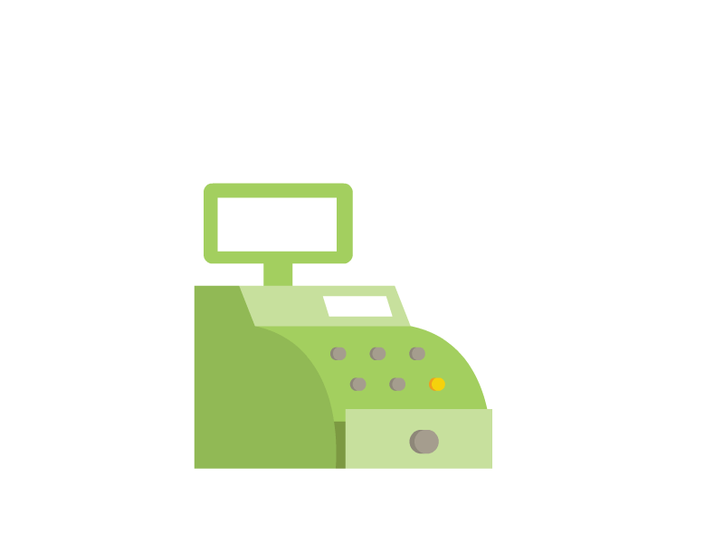

# Shmamazon

Welcome to "Shmamazon" - a legally distinct online buying and selling platform for all your various odds and ends!

Shmamazon is an app developed as a training excercise and therefore is not something for which the creator would go through any real lengths to defend in court.

The goal of this app is to simulate an online buying experience, complete with active inventory and price totals. 

Shmamazon is for everyone, although not every product shmamazon pretends to sell is for everyone. Please excercise discretion when browsing all of our wares. 

To start you simply need to select either shmamazonCustomer or shmamazonManger, Shmamazon will do the rest. Here's what to expect:

# Customer:

1. **List of Inventory** - First before anything else happens we'll show you a list of what we're selling along with product skus and the price per item. *Example:
Name: "The Life and Times of the Melrose Diner"
Price: $50
Product Sku: 129*
1. **Pick an Item** - After you've reviewed what we sell you'll be given a list of product names from which to choose. *Example: Lightning CrockPots*
1. **Choose a Quantity** - Enter how many of a product you'd like. We may not always have it, but we'll do our best.
1. **Check Out** - Finally after you've made your selections you will be updated with your final before recieving confirmation that the inventory has updated along with the new total remaining. *Example: You're total for today is: $163
SquiggleFighter Stock Updated! There are now 19 remaining!*

# Manager:
1. **View Products for Sale** - This will list all the products we sell with their name, department, price and ID.
1. **View Low Inventory** - This will return all the items that have a quantity of ten or fewer.
1. **Add to Inventory** - This will prompt you first for the name of the product you'd like to add, followed by it's department price and ID. It will then confirm the item has been added.
1. **Add to Inventory** - This will allow you to select an item from the list and increase it's quantity by a number of your choosing. 

>**Please Note:** As a CLI app everything must be done by initiating the app via the *node* command in the terminal.

If you need any assistance or have questions please continue to feverishly buy things until you feel better on the inside.

Here's a quick video demonstrating the functionality:
 

Happy buyings!

 